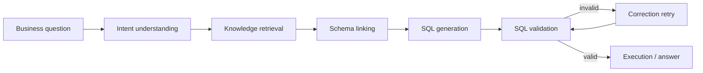

# NL2SQL Pipeline

The runtime keeps the generation path explicit and observable:

Each stage consumes canonical state from the current project and active artifact snapshot. The final response includes the generated SQL and runtime evidence needed to explain how it was produced.
